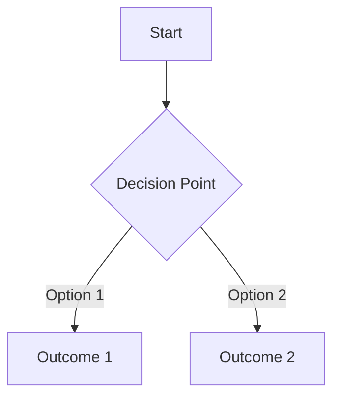

# ADR XXX: [Title]

**Status:** [Proposed | Accepted | Deprecated | Superseded]
**Date:** YYYY-MM-DD
**Deciders:** [List of people involved in the decision]

## Context

What is the issue that we're seeing that is motivating this decision or change?

## Decision Drivers

* [driver 1, e.g., a force, facing concern, …]
* [driver 2, e.g., a force, facing concern, …]
* …

## Considered Options

* [option 1]
* [option 2]
* [option 3]
* …

## Decision

We chose [option X] because [reasons].

### Positive Consequences

* ✅ [consequence 1]
* ✅ [consequence 2]
* …

### Negative Consequences

* ⚠️ [consequence 1]
* ⚠️ [consequence 2]
* …

## Implementation Details

[Optional: Technical details of how the decision is implemented]

```kotlin
// Code examples if relevant
```

## Alternatives Considered

### Option 1: [Name]
* **Pros**: [pros]
* **Cons**: [cons]
* **Rejection Reason**: [why this wasn't chosen]

### Option 2: [Name]
* **Pros**: [pros]
* **Cons**: [cons]
* **Rejection Reason**: [why this wasn't chosen]

## Validation

How did we validate this decision?

* [validation method 1]
* [validation method 2]

## Diagrams

[Optional: Mermaid diagrams or other visualizations]



## References

* [Link 1]
* [Link 2]

## Notes

[Any additional notes or context]
